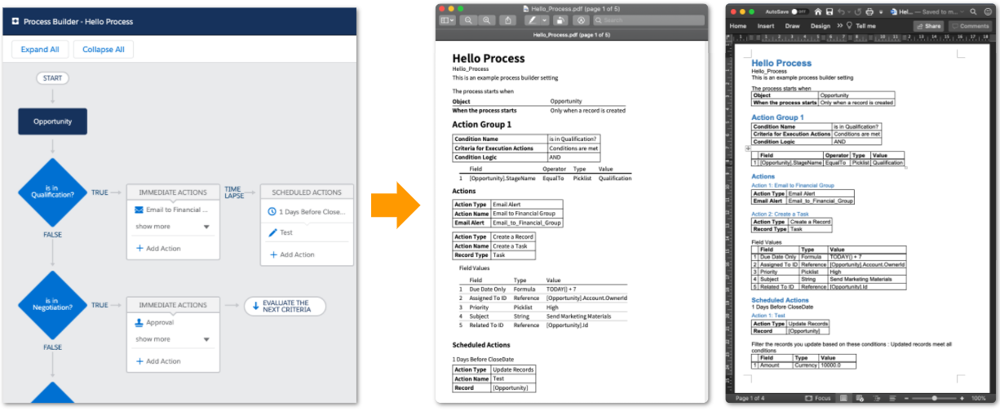

# Flowdoc (alpha)

A Salesforce CLI plugin that generates design document from Lightning flow metadata

[](https://github.com/shunkosa/sfdx-flowdoc-plugin/actions?query=workflow%3A%22unit%20test%22)
[](https://npmjs.org/package/sfdx-flowdoc-plugin)
[](https://codecov.io/gh/shunkosa/sfdx-flowdoc-plugin)
[](https://npmjs.org/package/sfdx-flowdoc-plugin)
[](https://github.com/shunkosa/sfdx-flowdoc-plugin/blob/master/package.json)



## Features

### Supported Flow

-   Trigger based Process
-   Platform Event based Process
-   Invocable Process

### Supported Actions

-   Chatter Post
-   Quick Action
-   Apex (Invocable Action)
-   Sub flow/process
-   Record Create
-   Record Update
-   Approval Process

### Output Format

-   Word (.docx)
-   PDF

## Setup

### Install as plugin

```
sfdx plugins:install sfdx-flowdoc-plugin
```

### Install from source

Clone this repo and run `npm install`. Then run,

```
sfdx plugins:link .
```

## Usage

Specify an API name of your process

### PDF output

```
sfdx flowdoc:pdf:generate Example_Process
```

### Word output

```
sfdx flowdoc:docx:generate Example_Process
```

### Locale

Add `-l (--locale) ja` option to export Japanese document.

```
sfdx flowdoc:pdf:generate Example_Process -l ja
```

## Feedback

Feature requests, bug reports and pull requests are welcome!

## Coming Soon

-   Flow Builder
-   Diagram
